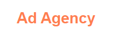

  

	
	
	

_Para a versão em Português, clique [aqui](#portuguese)._ 

### Topics

- [Project description](#project-description)

- [Technologies used](#technologies-used)

- [What I learned](#what-I-learned)

- [Access the Project](#access-the-project)

## Project description

This is a landing page for a fictitious ad agency. This project was created during the frontend development course [DevQuest](https://devemdobro.com/lista/) in the HTML and CSS intermediate module.

## Technologies used

  
  

## What I learned

- How to create the layout using Grid;
- Position elements in a more responsive way using Flex;
- Create a hamburger menu with CSS only;
- Create an animated arrow with CSS only.

## Access the Project

You can [access the project here](https://bo83dev.github.io/ad-agency/) 

Mobile

Desktop

<h1 align='center'> Ad Agency </h1>

	
	
	

### Tópicos 

- [Descrição do projeto](#descrição-do-projeto)

- [Tecnologias utilizadas](#tecnologias-utilizadas)

- [O que aprendi](#o-que-aprendi)

- [Acesse o projeto](#acesse-o-projeto)

## Descrição do projeto 

Essa é uma landing page de uma agência de publicidade fictícia. Esse projeto foi criado durante o curso de desenvolvimento frontend [DevQuest](https://devemdobro.com/lista/) no módulo intermediário de HTML e CSS.

## Tecnologias utilizadas

  
  

## O que aprendi

- Como criar o layout usando Grid;
- Posicionar elementos responsivamente usando Flex;
- Criar um menu 'hamburguer' usando CSS;
- Criar uma seta animada usando CSS.

## Acesse o projeto

Mobile

Desktop

Developed with 🧡 by me!  [Carol Vilar](https://www.linkedin.com/in/carolinebarbosavilar/)
